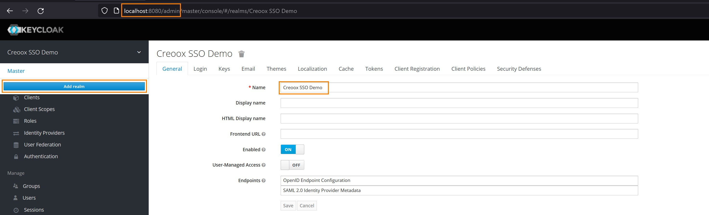
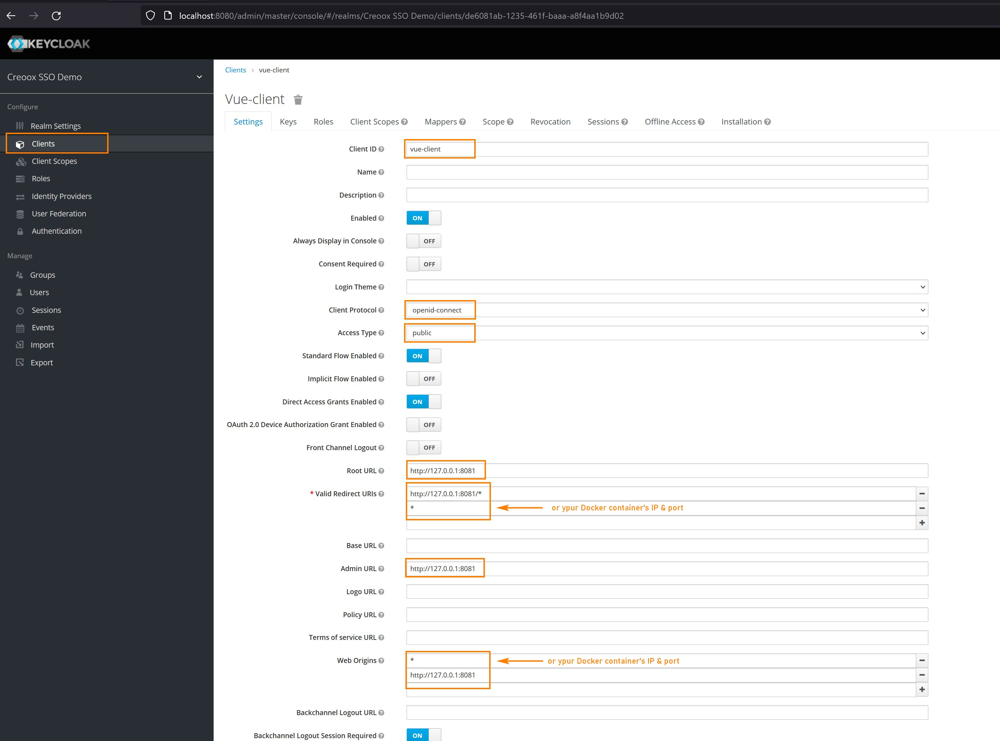
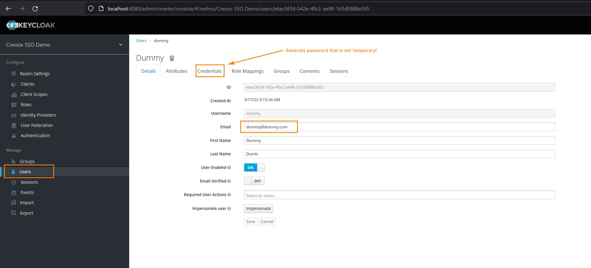

# Project setup (contenerized)

## Prerequisites

1. [IMPORTANT] Running Keycloak server (see info below)
2. [docker](https://docs.docker.com/get-docker/)
3. [docker-compose](https://docs.docker.com/compose/install/)
4. [Optional & Recommended] **GNU make** (see below)

### GNU make - Make use of _Makefile_

It is recommended to make use of _make_ commands and in order to do so install _GNU make_

- Unix/Linux -> ready-to-go [more info](https://makefiletutorial.com/#running-the-examples)
- Windows (Powershell) -> [install chocolatey](https://chocolatey.org/install) and then run `choco install make` in **Powershell**
- MacOS -> TODO

## Keycloak server

It is recomended to set up **Keycloak** as described on [getting-started-docker](https://www.keycloak.org/getting-started/getting-started-docker).
Mind that used version in demo project is **17.0.0**

1. Log-in to Keycloak Admin Console and create new realm called _Creoox SSO Demo_ (see below)

   [](setup-realm.jpg)

2. Create VueJS App Client in _Creoox SSO Demo_ realm

   [](setup-client.jpg)

3. Create sample user to log-in and use the App

   [](setup-user.jpg)

## Development Environemt

**Mind that all below commands can be run natively using docker-compose (not recommended, see _Makefile_ for details)**

### Prepare development environmet

```
make build-dev-env
```

### Run development environment

```
make run-dev-env
```

### Run development environment interactively

```
run-dev-env-it
```

### Shut down and clean development environmet

```
make down-dev-env
```

### Customize configuration

See [Configuration Reference](https://cli.vuejs.org/config/).
